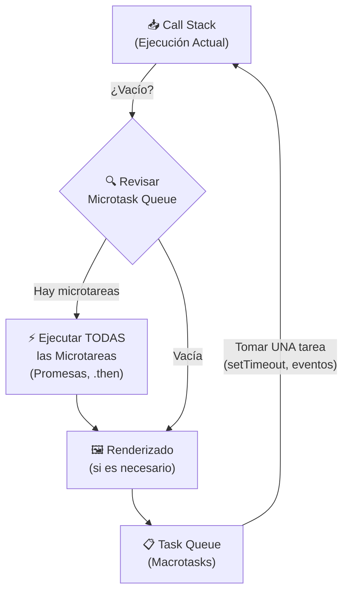

# Reporte de Actividad: Desarrollo Web Avanzado – Segundo Parcial

**Alumno:** Luis Romo  
**Proyecto:** Tienda de Flores "Fori"  
**Tecnologías:** Vue.js 3 + CSS Variables + Vanilla JS Modular  
**Fecha:** 10 de Marzo, 2026

---

## PARTE 1 – FUNDAMENTOS TEÓRICOS

### 1.1 Sincronía vs Asincronía

La **sincronía** implica que las instrucciones se ejecutan secuencialmente y en orden. El hilo principal espera a que cada operación termine antes de seguir. Esto provoca "bloqueo" cuando hay operaciones lentas (I/O, red, etc.).

La **asincronía** permite que el programa inicie una operación y continúe ejecutando el código siguiente sin esperar el resultado. El resultado se maneja posteriormente cuando la operación termina.

**Comparativa de código:**
```javascript
// --- SÍNCRONO (BLOQUEANTE) ---
function obtenerDatos() {
    const inicio = Date.now();
    while (Date.now() - inicio < 3000) {
        // Bloquea el hilo principal durante 3 segundos
        // El usuario no puede hacer NADA durante este tiempo
    }
    return "datos obtenidos";
}

// --- ASÍNCRONO (NO BLOQUEANTE) ---
async function obtenerDatosAsync() {
    // El hilo principal queda libre mientras espera la respuesta
    const respuesta = await fetch('https://api.ejemplo.com/datos');
    return await respuesta.json();
}
```

---

### 1.2 El Event Loop

El **Event Loop** es el mecanismo central de JavaScript que permite la ejecución asíncrona en un lenguaje monohilo. Funciona coordinando tres elementos:

- **Call Stack:** Pila de llamadas de funciones activas en este momento
- **Microtask Queue:** Cola de alta prioridad para Promesas resueltas y `MutationObserver`
- **Task Queue (Macrotasks):** Cola para `setTimeout`, `setInterval` y eventos del navegador

**Regla de ejecución:** Antes de pasar a la siguiente macrotarea, el Event Loop vacía completamente la Microtask Queue.



**Ejemplo práctico del orden de ejecución:**
```javascript
console.log("1 - Síncrono");

setTimeout(() => console.log("4 - Macrotask (setTimeout)"), 0);

Promise.resolve().then(() => console.log("3 - Microtask (Promesa)"));

console.log("2 - Síncrono");

// Salida en consola:
// 1 - Síncrono
// 2 - Síncrono
// 3 - Microtask (Promesa)    <- Prioridad sobre setTimeout
// 4 - Macrotask (setTimeout)
```

---

### 1.3 Promesas y Async/Await

Una **Promesa** representa un valor que puede estar disponible ahora, en el futuro, o nunca.

```javascript
// Promesa manual
const miPromesa = new Promise((resolve, reject) => {
    const exito = true;
    if (exito) resolve("Datos cargados");
    else reject(new Error("Falló la carga"));
});

// Encadenamiento con .then() y .catch()
miPromesa
    .then(resultado => console.log(resultado))
    .catch(error => console.error(error.message));
```

**Async/Await** es azúcar sintáctica sobre Promesas que hace el código asíncrono más legible:
```javascript
// Equivalente con async/await
async function cargarDatos() {
    try {
        const resultado = await miPromesa;
        console.log(resultado);
    } catch (error) {
        console.error(error.message);
    }
}
```

---

### 1.4 Manejo de Errores Asíncronos

Sin manejo adecuado, los errores en código asíncrono son silenciosos y difíciles de rastrear.

```javascript
// MAL: Error silencioso no capturado
async function sinManejo() {
    const data = await fetch('/api/inexistente'); // 404 - pero no lanza error
    const json = await data.json(); // Puede fallar aquí silenciosamente
}

// BIEN: Manejo explícito con try/catch y verificación de estado
async function conManejo() {
    try {
        const data = await fetch('/api/datos');
        if (!data.ok) throw new Error(`HTTP ${data.status}: ${data.statusText}`);
        return await data.json();
    } catch (error) {
        if (error.name === 'AbortError') {
            console.log('Petición cancelada por el usuario');
        } else {
            console.error('Error de red:', error.message);
            throw error; // Re-lanzar para que el componente lo maneje
        }
    }
}
```

---

### 1.5 Bloqueo del Hilo Principal

El hilo principal puede ser bloqueado por operaciones costosas. Existen dos técnicas para evitarlo:

```javascript
// Minimización de Reflows con requestAnimationFrame
// MAL: Múltiples lecturas y escrituras del DOM en el mismo frame (Layout Thrashing)
elementos.forEach(el => {
    const altura = el.offsetHeight; // Lectura → fuerza un 'reflow'
    el.style.height = (altura + 10) + 'px'; // Escritura → invalida el layout
});

// BIEN: Separar lecturas de escrituras usando rAF
requestAnimationFrame(() => {
    const alturas = elementos.map(el => el.offsetHeight); // Leer primero
    alturas.forEach((altura, i) => {
        elementos[i].style.height = (altura + 10) + 'px'; // Luego escribir
    });
});
```

---

### 1.6 Concurrencia vs Paralelismo

| Concepto | Definición | En JavaScript |
|---|---|---|
| **Concurrencia** | Múltiples tareas progresan intercaladas | ✅ Nativo (Event Loop) |
| **Paralelismo** | Múltiples tareas corren simultáneamente en diferentes hilos | ⚠️ Solo con Web Workers |

JavaScript es **concurrente pero no paralelo** en el hilo principal. Puede manejar múltiples peticiones simultáneas gracias al Event Loop, pero no ejecuta JavaScript en paralelo.

---

## PARTE 2 – IMPLEMENTACIÓN ASÍNCRONA AVANZADA

### 2.1 Dashboard Dinámico

El componente `DashboardAdmin.vue` implementa la carga simultánea de **usuarios** y **posts** desde una API pública, con indicador de carga, buscador con debounce y manejo visual de errores.

**Template del Dashboard:**
```html
<!-- DashboardAdmin.vue - Template -->
<div class="dashboard-admin">
    <!-- Buscador con Debounce -->
    <div class="search-bar">
        <input
            type="text"
            :value="searchQuery"
            @input="handleInputDebounced"
            placeholder="Buscar usuarios o publicaciones..."
        />
        <span class="search-info">Filtrado con Debounce puro (300ms)</span>
    </div>

    <!-- Loader CSS mientras cargan los datos -->
    <div v-if="loading" class="loader-container">
        <div class="pure-css-loader"></div>
        <p>Cargando datos simultáneos con Promise.all...</p>
    </div>

    <!-- Manejo Visual de Errores -->
    <div v-if="errorMsg" class="error-banner">
        <div class="error-icon">⚠️</div>
        <div class="error-content">
            <h3>Error en la Carga de Datos</h3>
            <p>{{ errorMsg }}</p>
            <button @click="cargarDatos(false)">Reintentar</button>
        </div>
    </div>
</div>
```

---

### 2.2 Múltiples Peticiones Simultáneas con `Promise.all()`

`Promise.all()` ejecuta todas las promesas en paralelo y espera a que TODAS terminen. Si cualquiera falla, el catch se activa inmediatamente.

```javascript
// DashboardAdmin.vue - método cargarDatos()
async cargarDatos(simularFallo = false) {
    this.loading = true;
    this.errorMsg = null;

    try {
        // Las dos peticiones se disparan AL MISMO TIEMPO (no una después de otra)
        const postsUrl = simularFallo
            ? 'https://jsonplaceholder.typicode.com/posts_ERROR' // URL inválida
            : 'https://jsonplaceholder.typicode.com/posts';

        const [usersResponse, postsResponse] = await Promise.all([
            fetch('https://jsonplaceholder.typicode.com/users'),
            fetch(postsUrl)
        ]);

        // Verificación manual del código HTTP (fetch no lanza error en 404)
        if (!usersResponse.ok) throw new Error(`Error Usuarios: ${usersResponse.status}`);
        if (!postsResponse.ok) throw new Error(`Error Posts: ${postsResponse.status}`);

        // Convertir JSON (también son operaciones async simultáneas)
        const [usersData, postsData] = await Promise.all([
            usersResponse.json(),
            postsResponse.json()
        ]);

        this.users = usersData;
        this.posts = postsData;

    } catch (err) {
        // Si UNA falla, Promise.all aborta todo (principio "Todo o Nada")
        this.errorMsg = "Fallo en el módulo: " + err.message;
    } finally {
        this.loading = false; // Siempre se ejecuta, haya error o no
    }
}
```

**Análisis de qué ocurre si una petición falla:**
- `Promise.all` tiene comportamiento **"fail-fast"**: en cuanto una promesa se rechaza, el resultado completo es un rechazo.
- Los datos de la API que sí respondió correctamente se **descartan**.
- Para manejar errores parciales se usa `Promise.allSettled()`:

```javascript
// Con Promise.allSettled() - manejo de errores individuales
const resultados = await Promise.allSettled([
    fetch('/api/usuarios'),
    fetch('/api/posts')
]);

resultados.forEach((resultado, i) => {
    if (resultado.status === 'fulfilled') {
        console.log(`Petición ${i} exitosa`);
    } else {
        console.warn(`Petición ${i} falló:`, resultado.reason);
    }
});
```

---

### 2.3 Cancelación con `AbortController`

Evita que una petición lenta devuelva datos cuando ya no son necesarios (por ejemplo, si el usuario navegó a otra página).

```javascript
// src/services/api.js - Sistema completo con caché y cancelación
const cache = new Map();
let controller = null; // Referencia global al controlador actual

export const fetchData = async (endpoint) => {
    // 1. Cancelar la petición anterior si todavía está pendiente
    if (controller) {
        controller.abort(); // Envía señal de cancelación al fetch anterior
    }
    controller = new AbortController();
    const { signal } = controller; // La señal que se pasa al fetch

    // 2. Verificar la caché primero para evitar llamadas innecesarias
    if (cache.has(endpoint)) {
        console.log("📦 Cargando desde caché:", endpoint);
        return cache.get(endpoint);
    }

    // 3. Petición real a la API con la señal de aborto
    try {
        const response = await fetch(`http://localhost:8000/api${endpoint}`, { signal });

        if (!response.ok) throw new Error(`HTTP ${response.status}`);

        const data = await response.json();

        // 4. Guardar en caché para futuros accesos
        cache.set(endpoint, data);
        return data;

    } catch (error) {
        if (error.name === 'AbortError') {
            console.log('🚫 Petición cancelada (nueva petición en camino)');
            return null; // No es un error real, solo una cancelación
        }
        throw error; // Re-lanzar errores reales de red
    }
};
```

---

### 2.4 Debounce en el Buscador

Implementación propia sin librerías externas, igual a la especificada en la actividad:

```javascript
// DashboardAdmin.vue - Función debounce pura
function debounce(fn, delay) {
   let timeout;
   return (...args) => {
      clearTimeout(timeout); // Cancela el timer previo si existe
      timeout = setTimeout(() => fn(...args), delay); // Reinicia el conteo
   };
}

// Inicialización en el hook created() del componente
created() {
    this.debounceFn = debounce((val) => {
        this.debouncedSearchQuery = val; // Solo actualiza despues de 300ms sin escribir
    }, 300);
},
methods: {
    handleInputDebounced(event) {
        this.searchQuery = event.target.value; // Input visual inmediato
        this.debounceFn(event.target.value);   // Filtrado con delay
    }
}
```

**Filtros computados reactivos:**
```javascript
computed: {
    filteredUsers() {
        const q = this.debouncedSearchQuery.toLowerCase();
        if (!q) return this.users;
        return this.users.filter(u =>
            u.name.toLowerCase().includes(q) ||
            u.email.toLowerCase().includes(q)
        );
    },
    filteredPosts() {
        const q = this.debouncedSearchQuery.toLowerCase();
        if (!q) return this.posts;
        return this.posts.filter(p => p.title.toLowerCase().includes(q));
    }
}
```

---

## PARTE 3 – ANIMACIONES Y TRANSICIONES AVANZADAS

### 3.1 Animaciones con Scroll y `IntersectionObserver`

El sistema observa elementos del DOM y aplica clases CSS cuando entran en el viewport.

**Directiva Vue Reutilizable (`src/js/animations.js`):**
```javascript
// Observador compartido por todos los elementos (más eficiente que uno por elemento)
const observer = new IntersectionObserver(
    (entries) => {
        entries.forEach((entry) => {
            if (entry.isIntersecting) {
                entry.target.classList.add('is-visible');
            } else {
                // Opcional: re-animar al subir el scroll
                entry.target.classList.remove('is-visible');
            }
        });
    },
    {
        threshold: 0.1,        // Se activa cuando 10% del elemento es visible
        rootMargin: '0px 0px -50px 0px' // Margen de activación (50px antes del borde)
    }
);

export default {
    mounted(el, binding) {
        el.classList.add('scroll-animate');

        // Animaciones escalonadas: v-scroll="'200ms'"
        if (binding.value) {
            el.style.transitionDelay = binding.value; // Ej: '200ms', '400ms'
        }

        // Dirección personalizable: v-scroll:left, v-scroll:right, v-scroll:up
        el.classList.add(binding.arg ? `scroll-animate-${binding.arg}` : 'scroll-animate-up');

        observer.observe(el); // Registrar el elemento con el observer
    },
    unmounted(el) {
        observer.unobserve(el); // Limpiar al destruir el componente
    }
};
```

**Clases CSS correspondientes (`src/css/animations.css`):**
```css
/* Estado inicial: invisible y desplazado */
.scroll-animate {
    opacity: 0;
    transition: opacity 0.8s ease-out, transform 0.8s ease-out;
    will-change: opacity, transform; /* Hint al navegador: usar GPU */
}

/* Direcciones de entrada */
.scroll-animate-up    { transform: translateY(50px); }
.scroll-animate-down  { transform: translateY(-50px); }
.scroll-animate-left  { transform: translateX(50px); }
.scroll-animate-right { transform: translateX(-50px); }

/* Estado final: visible, posición original */
.scroll-animate.is-visible {
    opacity: 1;
    transform: translateY(0) translateX(0) scale(1);
}
```

**Uso en los templates de Vue con animaciones escalonadas:**
```html
<!-- Entrada desde abajo (por defecto) -->
<div v-scroll>Elemento 1</div>

<!-- Entrada desde la izquierda con delay -->
<div v-scroll:left="'200ms'">Elemento 2</div>

<!-- Entrada desde la derecha con delay mayor (efecto escalonado) -->
<div v-scroll:right="'400ms'">Elemento 3</div>
```

---

### 3.2 Mostrar/Ocultar con Transición Suave

No se usa `display: none`. La visibilidad se controla con `opacity`, `height` y `transform` para que las transiciones CSS funcionen correctamente.

```css
/* Técnica implementada: height animada + opacity */
.panel-colapsable {
    overflow: hidden;
    max-height: 0;
    opacity: 0;
    transform: translateY(-10px);
    transition: max-height 0.4s ease, opacity 0.4s ease, transform 0.4s ease;
}

.panel-colapsable.abierto {
    max-height: 500px; /* Valor mayor al contenido real */
    opacity: 1;
    transform: translateY(0);
}
```

---

### 3.3 Efecto Parallax con Movimiento del Mouse

Implementado como directiva reutilizable de Vue. Mueve el elemento suavemente en dirección opuesta al cursor.

**Código completo (`src/js/dom.js`):**
```javascript
export default {
    mounted(el, binding) {
        const strength = binding.value?.strength || 20;

        // Guardar el transform original para restaurarlo al salir
        el.dataset.initialTransform = el.style.transform || '';

        el.handleMouseMove = (e) => {
            // Calcular desplazamiento relativo al centro de la ventana
            const x = (window.innerWidth  - e.pageX * 2) / (100 / strength);
            const y = (window.innerHeight - e.pageY * 2) / (100 / strength);

            // requestAnimationFrame: sincronización con el refresco del monitor (60fps)
            window.requestAnimationFrame(() => {
                el.style.transform =
                    `${el.dataset.initialTransform} translateX(${x}px) translateY(${y}px)`;
            });
        };

        el.handleMouseLeave = () => {
            window.requestAnimationFrame(() => {
                el.style.transform = el.dataset.initialTransform;
                el.style.transition = 'transform 0.5s ease-out'; // Retorno suave
                setTimeout(() => (el.style.transition = ''), 500);
            });
        };

        window.addEventListener('mousemove', el.handleMouseMove);
        window.addEventListener('mouseout', el.handleMouseLeave);
    },
    unmounted(el) {
        // Limpieza de listeners al destruir el componente (evita memory leaks)
        window.removeEventListener('mousemove', el.handleMouseMove);
        window.removeEventListener('mouseout', el.handleMouseLeave);
    }
};
```

**Uso en template:**
```html
<!-- Con intensidad por defecto (20) -->


<!-- Con intensidad personalizada -->
<div v-parallax="{ strength: 10 }">Texto que flota suavemente</div>
```

---

### 3.4 Efecto Magnético en Botones

Los botones "atraen" el cursor hacia su centro cuando el ratón se acerca, y regresan elásticamente al salir.

**Código (`src/js/app.js`):**
```javascript
export default {
    mounted(el, binding) {
        const strength = binding.value?.strength || 1;

        el.addEventListener('mousemove', (e) => {
            const rect = el.getBoundingClientRect();
            // Centro del botón
            const centerX = rect.width / 2;
            const centerY = rect.height / 2;
            // Posición del cursor relativa al botón
            const x = e.clientX - rect.left - centerX;
            const y = e.clientY - rect.top  - centerY;

            const multiplier = el.dataset.magneticStrength || strength;

            // rAF para suavidad y eficiencia
            requestAnimationFrame(() => {
                el.style.transform =
                    `translateX(${x * 0.4 * multiplier}px) translateY(${y * 0.4 * multiplier}px)`;
            });
        });

        el.addEventListener('mouseleave', () => {
            requestAnimationFrame(() => {
                // El botón regresa elásticamente a su posición original
                el.style.transition = 'transform 0.4s cubic-bezier(0.25, 0.8, 0.25, 1)';
                el.style.transform = 'translateX(0px) translateY(0px)';
                setTimeout(() => (el.style.transition = ''), 400);
            });
        });
    }
};
```

**Uso:**
```html
<button v-magnetic>Botón Normal</button>
<button v-magnetic="{ strength: 2 }">Botón Fuerte</button>
```

---

### 3.5 Carrusel Avanzado Sin Librerías

Implementado desde cero en `AdvancedCarousel.vue` con loop infinito simulado, autoplay y soporte táctil.

**Lógica del Loop Infinito (clones):**
```javascript
// Se agrega un clon del primer slide al final y del último al inicio
// [Clon-Último] [Slide1] [Slide2] [Slide3] [Clon-Primero]

computed: {
    extendedSlides() {
        const firstClone = { ...this.slides[0], id: 'clone-first' };
        const lastClone  = { ...this.slides[this.slides.length - 1], id: 'clone-last' };
        return [lastClone, ...this.slides, firstClone];
    }
}
```

**Transición suave sin costuras:**
```javascript
methods: {
    handleTransitionEnd() {
        this.isTransitioning = false;

        // Si llegamos al clon del último → saltar al último real (sin animación)
        if (this.currentIndex === 0) {
            this.currentIndex = this.slides.length;
        }
        // Si llegamos al clon del primero → saltar al primero real (sin animación)
        else if (this.currentIndex === this.extendedSlides.length - 1) {
            this.currentIndex = 1;
        }
    }
}
```

**Estilo del track (la cinta de slides):**
```javascript
computed: {
    trackStyle() {
        let dragOffset = 0;
        if (this.isDragging) {
            // Offset en % de ventana durante el deslizamiento táctil
            dragOffset = ((this.currentTouchX - this.touchStartX) / window.innerWidth) * 100;
        }
        return {
            transform: `translateX(calc(-${this.currentIndex * 100}% + ${dragOffset}%))`,
            // Sin transición mientras el dedo arrastra (movimiento 1:1 con el dedo)
            transition: (this.isTransitioning && !this.isDragging)
                        ? 'transform 0.5s ease-in-out'
                        : 'none'
        };
    }
}
```

**Soporte táctil (Touch Events):**
```javascript
methods: {
    handleTouchStart(e) {
        this.pauseAutoplay();
        this.isDragging = true;
        this.touchStartX = e.touches[0].screenX;
        this.currentTouchX = this.touchStartX;
    },
    handleTouchMove(e) {
        if (!this.isDragging) return;
        this.currentTouchX = e.touches[0].screenX; // Actualiza posición en tiempo real
    },
    handleTouchEnd(e) {
        this.isDragging = false;
        this.touchEndX = e.changedTouches[0].screenX;
        this.handleSwipeGesture();
        this.startAutoplay();
    },
    handleSwipeGesture() {
        const diferencia = this.touchStartX - this.touchEndX;
        if (Math.abs(diferencia) > this.swipeThreshold) { // 50px mínimo
            diferencia > 0 ? this.nextSlide() : this.prevSlide();
        }
    }
}
```

---

## PARTE 4 – ARQUITECTURA OBLIGATORIA

### 4.1 Estructura de Archivos

```
/fori/src
  ├── App.vue              ← Raíz: registra componentes globales
  ├── main.js              ← Punto de entrada: registra directivas globales
  ├── /css
  │   ├── base.css         ← Tokens de diseño (variables CSS de Tema)
  │   └── animations.css   ← Clases y keyframes de animación reutilizables
  ├── /js
  │   ├── animations.js    ← Directiva v-scroll (IntersectionObserver)
  │   ├── dom.js           ← Directiva v-parallax (MouseMove)
  │   ├── app.js           ← Directiva v-magnetic (Botones magnéticos)
  │   ├── cache.js         ← Caché de datos
  │   └── api.js           ← Servicio de peticiones HTTP
  ├── /services
  │   └── api.js           ← fetchData: caché + AbortController
  ├── /views
  │   ├── DashboardAdmin.vue   ← Dashboard con Promise.all
  │   ├── Constructor.vue      ← Armador de ramos con Drag & Drop
  │   └── ...
  └── /components/common
      ├── AdvancedCarousel.vue ← Carrusel sin librerías
      ├── LiveNotifications.vue ← WebSocket Simulado (Reto Final)
      └── FlowerCursor.vue     ← Cursor interactivo personalizado
```

### 4.2 Registro de Directivas Globales (`main.js`)

```javascript
import { createApp } from 'vue'
import App from './App.vue'
import router from './router'

// Importar módulos de directivas (separación de responsabilidades)
import vScroll    from './js/animations.js'  // IntersectionObserver
import vParallax  from './js/dom.js'         // Efecto Parallax
import vMagnetic  from './js/app.js'         // Efecto Magnético

// Importar estilos globales del sistema de diseño
import './css/animations.css'
import './css/base.css'

const app = createApp(App)
app.use(router)

// Registrar como directivas globales (accesibles en CUALQUIER componente)
app.directive('scroll',    vScroll)
app.directive('parallax',  vParallax)
app.directive('magnetic',  vMagnetic)

app.mount('#app')
```

### 4.3 Sistema de Variables CSS (Patrón Observer)

El tema de colores sigue un patrón similar al Observer: los componentes "observan" las variables CSS y reaccionan automáticamente cuando `body.dark-theme` se activa.

```css
/* base.css - Tokens de diseño (Tema Claro) */
:root {
    --bg-creme:   #FDF9F1;
    --text-soft:  #5A4A42;
    --primary-pink: #F4B8C1;
    --accent-pink:  #D66D81;
    --card-bg:    #FFFFFF;
    --card-shadow: rgba(0,0,0,0.05);
}

/* Tema Oscuro: sobreescribir variables (todos los componentes se actualizan solos) */
body.dark-theme {
    --bg-creme:   #1A1A1A;
    --text-soft:  #EAE0D5;
    --primary-pink: #9A3F5B;
    --accent-pink:  #FF8BA7;
    --card-bg:    #1e1e1e;
    --card-shadow: rgba(255,255,255,0.05);
}
```

---

## PARTE 5 – OPTIMIZACIÓN Y RENDIMIENTO

### 5.1 requestAnimationFrame (rAF)

Usado en todos los efectos de mouse para sincronizar con el refresco del monitor (60 fps = cada ~16ms).

```javascript
// SIN rAF: puede ejecutarse fuera de sincronía, causando "jank" visual
el.addEventListener('mousemove', (e) => {
    el.style.transform = `translateX(${e.clientX}px)`; // Puede ejecutarse múltiples veces por frame
});

// CON rAF: ejecuta exactamente una vez por frame de renderizado
el.addEventListener('mousemove', (e) => {
    requestAnimationFrame(() => {
        el.style.transform = `translateX(${e.clientX}px)`;
    });
});
```

### 5.2 `will-change` y Aceleración por GPU

```css
/* Avisar al navegador qué propiedades van a cambiar → crear una capa en GPU */
.scroll-animate {
    will-change: opacity, transform; /* El navegador crea una capa de composición */
    /* IMPORTANTE: no abusar, solo en elementos con animaciones activas */
}

.carousel-track {
    will-change: transform; /* Para las transiciones del carrusel */
}
```

### 5.3 Debounce y Throttle

```javascript
// DEBOUNCE: ejecutar solo cuando el usuario deja de escribir
function debounce(fn, delay) {
    let timeout;
    return (...args) => {
        clearTimeout(timeout);
        timeout = setTimeout(() => fn(...args), delay);
    };
}

// THROTTLE: ejecutar como máximo una vez cada N milisegundos
function throttle(fn, interval) {
    let lastTime = 0;
    return (...args) => {
        const now = Date.now();
        if (now - lastTime >= interval) {
            lastTime = now;
            fn(...args);
        }
    };
}

// Uso en la búsqueda del Dashboard:
this.debounceFn = debounce((val) => { this.debouncedSearchQuery = val; }, 300);
```

### 5.4 Medición de Rendimiento

```javascript
// Medir el tiempo de carga del Dashboard
async cargarDatos() {
    console.time("⏱️ Dashboard-Load");

    const [users, posts] = await Promise.all([
        fetch('/api/users').then(r => r.json()),
        fetch('/api/posts').then(r => r.json())
    ]);

    console.timeEnd("⏱️ Dashboard-Load"); // Imprime: ⏱️ Dashboard-Load: 347ms (aprox)
}
```

---

## PARTE 6 – RETO FINAL: ACTUALIZACIÓN EN TIEMPO REAL

### 6.1 WebSocket Simulado (Polling Inteligente)

Implementado en `LiveNotifications.vue`. Usa `setTimeout` recursivo con intervalos aleatorios para simular el comportamiento irregular de un stream de eventos real.

```javascript
// LiveNotifications.vue
methods: {
    startMockWebSocket() {
        const scheduleNextEvent = () => {
            // Intervalo aleatorio entre 5 y 15 segundos (simula un servidor real)
            const delay = Math.floor(Math.random() * 10000) + 5000;

            this.wsSimulator = setTimeout(() => {
                // Seleccionar un evento aleatorio del pool de datos simulados
                const evento = this.mockDataPool[
                    Math.floor(Math.random() * this.mockDataPool.length)
                ];

                // Crear el evento con ID único basado en timestamp
                const mockEvent = {
                    id: `evt-${Date.now()}-${Math.floor(Math.random() * 1000)}`,
                    ...evento
                };

                this.handleIncomingData(mockEvent);
                scheduleNextEvent(); // Recursividad → siguiente evento
            }, delay);
        };

        scheduleNextEvent(); // Iniciar el ciclo
    }
}
```

### 6.2 Prevención de Duplicados

```javascript
data() {
    return {
        seenIds: new Set(), // Set para búsqueda en O(1) - mucho más eficiente que Array.includes()
    }
},
methods: {
    handleIncomingData(data) {
        // Verificar si ya procesamos este ID
        if (this.seenIds.has(data.id)) {
            console.warn(`[Duplicado bloqueado] ID: ${data.id}`);
            return; // Salir sin procesar
        }

        // Registrar ID como visto
        this.seenIds.add(data.id);

        // Control de memoria: limpiar el Set si crece demasiado
        if (this.seenIds.size > 1000) {
            this.seenIds.clear();
        }

        // Agregar al inicio para que aparezca arriba con la animación de Vue
        this.activeNotifications.unshift(data);

        // Auto-eliminar después de 6 segundos
        setTimeout(() => this.removeNotification(data.id), 6000);

        // Limitar a máximo 3 notificaciones visibles
        if (this.activeNotifications.length > 3) {
            this.activeNotifications.pop();
        }
    }
}
```

### 6.3 Animación de Entrada con Vue `<transition-group>`

```html
<!-- Las animaciones de entrada/salida se definen con transition-group -->
<transition-group name="notification-list" tag="div" class="notifications-wrapper">
    <div v-for="n in activeNotifications" :key="n.id" class="live-notification">
        <!-- contenido de la notificación -->
    </div>
</transition-group>
```

```css
/* CSS de las animaciones de Vue (prefijo: nombre del transition-group) */

/* Entrada: desde la derecha con efecto rebote */
.notification-list-enter-from {
    opacity: 0;
    transform: translateX(50px) scale(0.9);
}

/* Salida: hacia arriba desvaneciéndose */
.notification-list-leave-to {
    opacity: 0;
    transform: translateY(-30px) scale(0.9);
}

/* Velocidad y tipo de curva de las transiciones */
.notification-list-enter-active,
.notification-list-leave-active {
    transition: all 0.5s cubic-bezier(0.68, -0.55, 0.265, 1.55); /* Efecto rebote */
}

/* Anima la reubicación de los elementos restantes al eliminar uno */
.notification-list-move {
    transition: transform 0.5s ease;
}
```

### 6.4 Integración Global en la Aplicación

El componente `LiveNotifications` está registrado directamente en `App.vue` para que esté presente en todas las vistas de la aplicación sin necesidad de importarlo en cada una.

```html
<!-- App.vue -->
<template>
    <div id="app">
        <FlowerCursor />
        <Navbar />
        <main>
            <router-view /> <!-- Vistas dinámicas -->
        </main>
        <Footer />

        <!-- Siempre visible, independiente de la ruta actual (Parte 6) -->
        <LiveNotifications />
    </div>
</template>
```

---

> [!IMPORTANT]
> Todo el sistema de estilos (toasts, carrusel, botones magnéticos, dashboard) utiliza **variables CSS** definidas en `base.css`. Esto significa que el **Modo Oscuro** funciona sin duplicar código: simplemente se sobreescriben las variables en `body.dark-theme` y los cambios se propagan automáticamente a todos los componentes.

> [!NOTE]
> El proyecto está desarrollado con **Vue.js 3** usando la Options API. Las directivas personalizadas (`v-scroll`, `v-parallax`, `v-magnetic`) son la capa de abstracción que encapsula la lógica de animación e interacción, siguiendo el principio de **Separación de Responsabilidades** requerido en la Parte 4.
